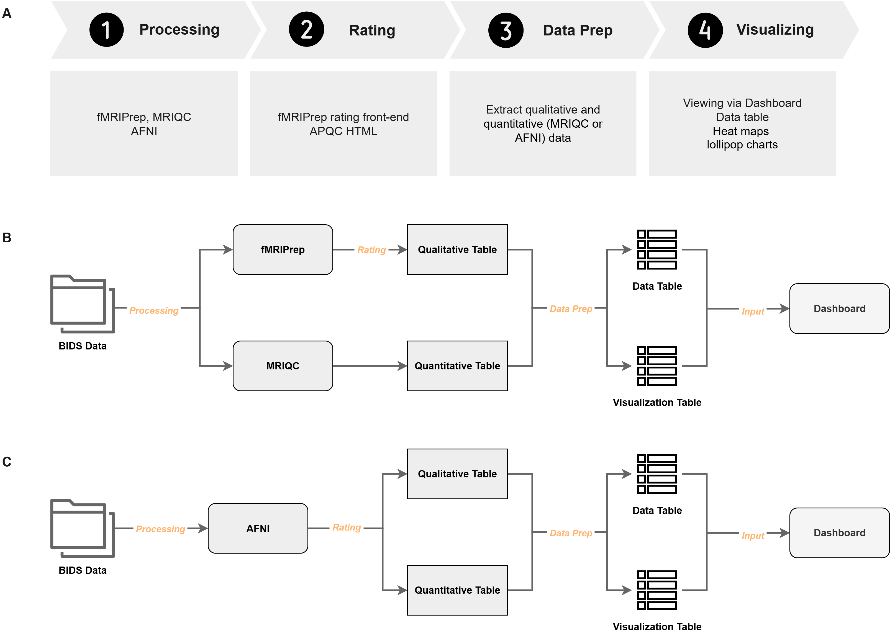
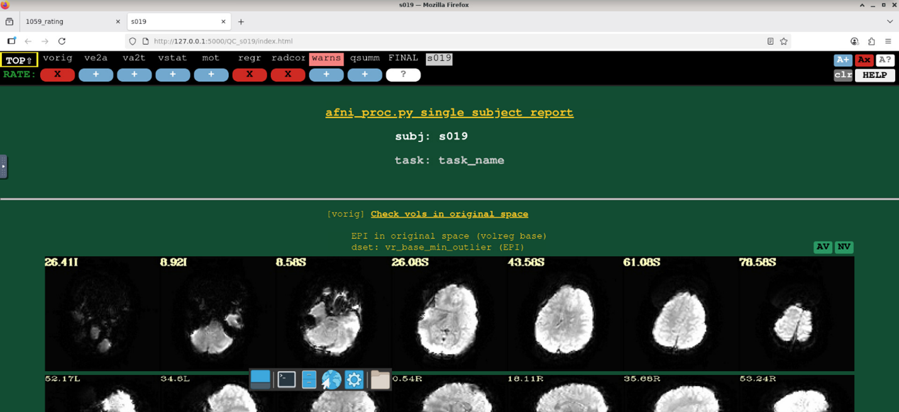
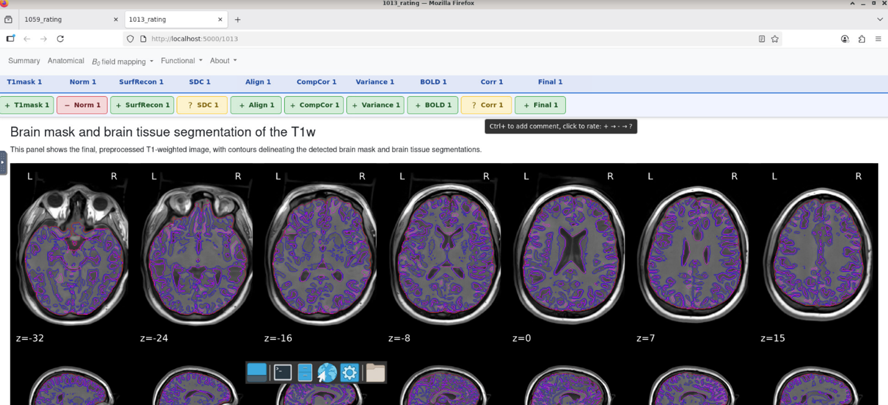
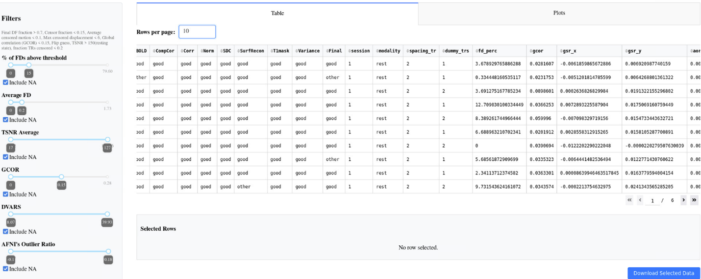
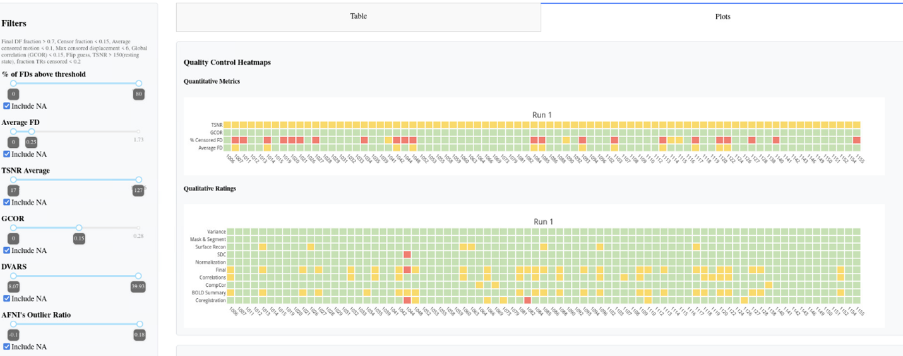
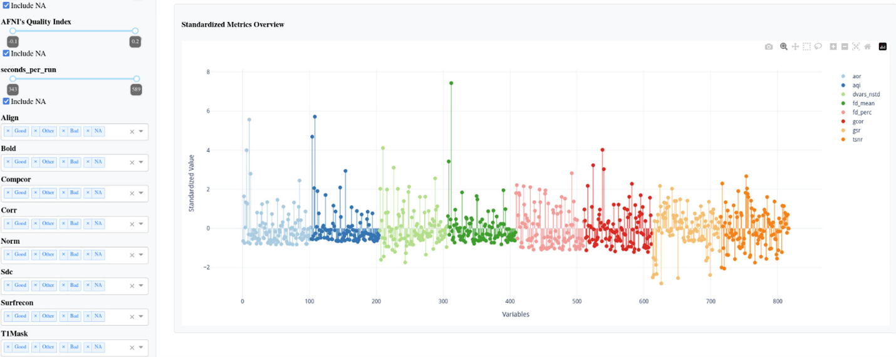

# fMRI-QCtoolkit
The package is still in development.

fMRI-QCtoolkit is a modular Python package for fMRI (functional Magnetic Resonance Imaging) quality control (QC), integrating quantitative metrics from [MRIQC](https://mriqc.readthedocs.io/en/latest/), [fMRIPrep](https://fmriprep.org/en/stable/), and [AFNI](https://afni.nimh.nih.gov/), along with manual scoring. The package includes an interactive dashboard with customizable filters and visualizations, a lightweight front-end for manual rating for fMRIPrep, and supports batch-level scoring for both fMRIPrep and AFNI outputs.



## Install
1. Create or activate a virtual environment.
2. Prepare the package code (clone or download the repository).
3. Navigate to the root folder containing pyproject.toml and install the package.

```bash
cd /path/to/your/package

pip install .

# Or developmental mode
# pip install -e .[dev]
```

# Usage

## STEP1: Rating

After the completion of preprocessing, perform qualitative scoring on the derivatives.

### AFNI
AFNI provides [scripts](https://afni.nimh.nih.gov/pub/dist/doc/htmldoc/tutorials/apqc_html/browsing.html#using-a-script-to-load-many-apqc-html-files) for browsing multiple subjects' QC files. However, using `firefox` on HPC (High-performance computing) systems may result in issues interacting with buttons, so this using `open_apqc.py` is another option (while ensuring the required Python packages are activated in the environment).

The directory structure of AFNI derivatives is as follows:
```
.
└── AFNI_derivatives/
    ├── sub-001/
    │   └── ses-01/
    │       └── cards_output/
    │           └── sub-001.results/
    │               ├── QC_sub-001
    │               └── ...
    ├── sub-002
    ├── sub-003
    └── ...
```

**Input Arguments:**
- `qc rating afni`: Indicate which rating program.
- `--input-dir`: Root directory, containing results that preprocessed from different participants.
- `--subjects`: Support input multiple participants IDs.
- `--task`: Rating program will search `task` in `input-dir` to find the `QC_{subj}`
- `--prefix`: The prefix of participants IDs. 

**Example Synatx:**
```bash
qc rating afni --input-dir /PATH/AFNI_derivatives --subjects "003,009" --task ses-01/cards --prefix sub-
```

*Although I've tried to make the scoring criteria flexible, it may still not support all pathfinding scenarios. Therefore, you can also try [script version](examples/scripts/rating/afni_rating.sh).*

> [!IMPORTANT]  
> The rating program relies on the `open_apqc.py` tool developed by AFNI.  
> You can either:
> - Change the default AFNI binary path in `fMRI_QCtoolkit/cli.py`, or  
> - Provide a custom path using the `--afni-path` option when running the command.
> `qc rating afni --input-dir /PATH/AFNI_derivatives --subjects "003,009" --task ses-01/cards --prefix sub- --afni-path /PATH`



### fMRIPrep
The rating module in **fMRI-QCtoolkit** is based on the HTML reports generated by fMRIPrep (e.g., `sub-{ID}.html`).  
Each QC item maps directly to specific sections of the original [fMRIPrep report](https://fmriprep.org/en/stable/_static/SampleReport/sample_report.html).

- Brain mask and brain tissue segmentation of the T1w (T1mask)
- Spatial normalization of the anatomical T1w reference (Norm)
- Surface reconstruction (SurfRecon)
- Susceptibility distortion correction (SDC)
- Alignment of functional and anatomical MRI data (coregistration) (Align)
- Brain mask and (anatomical/temporal) CompCor ROIs (CompCor)
- Variance explained by t/aCompCor components (Variance)
- BOLD Summary (BOLD)
- Correlations among nuisance regressors (Corr)

The interface is divided into two parts:  
- **Upper panel**: navigate modules with a left-click; scroll horizontally with the mouse wheel.  
- **Lower panel**: interactive rating area, similar to [AFNI’s APQC HTML](https://afni.nimh.nih.gov/pub/dist/doc/htmldoc/tutorials/apqc_html/main_toc.html).  
  - Left-click to rate, Ctrl+click to add comments.  
  - Rating buttons toggle between: good (+, green), bad (×, red), and other (?, yellow).  
  - Results are saved automatically as CSV files (subject-level and task-level). Upon reopening the program with the same code, it will automatically retrieve the previous scores by extracting the subject-level CSV file.

> [!IMPORTANT]
> If the program cannot detect the session and run number, both will default to 1. For example, the saved CSV file name would be `sub-{ID}_ses-01_rest.csv`. Therefore, when merging with files generated by MRIQC, you need to modify the `ses` parameters.

> [!IMPORTANT]
> For multi-session subjects, fMRIPrep merges all T1w images into a single anatomical reference ([longitudinal processing](https://fmriprep.org/en/stable/workflows.html#longitudinal-processing)). T1mask / Norm / SurfRecon therefore describe that merged image: one rating per subject, not per session. If several images appear under one of these headings, the subject was processed more than once; check the `Get figure file:` line and rate the one from your current run.

The directory structure of fMRIPrep derivatives is as follows:
```
.
└── fMRIPrep_derivatives/
    ├── sub-001
    ├── sub-001.html
    ├── sub-002
    ├── sub-002.html
    ├── sub-003
    ├── sub-003.html
    ├── dataset_description.json
    ├── desc-aparcaseg_dseg.tsv
    ├── desc-aseg_dseg.tsv
    └── ...
```

**Input Arguments:**
- `qc rating fmriprep`: Indicate which rating program.
- `--input-dir`: Root directory, containing results that preprocessed from different participants.
- `--subjects`: Support input multiple participants IDs.
- `--output-dir`: Path for exporting the scoring CSV file.

**Example Synatx:**
```bash
qc rating fmriprep --input-dir /PATH/fMRIPrep_derivatives --output-dir /PATH/Output_dir --subjects "1013,1026"
```



## STEP2: Data Preparation
By extracting information from qualitative rating files, `qc prep` program then generates two dataframes to put into the dashboard.

### AFNI
After finishing preprocessing and rating, both quantitative and qualitative rating information are saved in `QC_{subj}/extra_info/out.ss_review.{subj}.json`. 

**Input Arguments:**
- `qc prep afni`: Indicate which rating program.
- `--input-dir`: Root directory, containing results that preprocessed from different participants.
- `--output-dir`: Path for exporting `df_final.csv` and `lollipop_chart_data.csv` files.
- `--task`: Prep program will search `task` in `input-dir` to find the `QC_{subj}/extra_info/out.ss_review.{subj}.json` across all participants.
- `--prefix`: The prefix of participants IDs.

**Example Synatx:**
```bash
qc prep afni --input-dir /PATH/AFNI_derivatives --task ses-01/kidvid --output-dir /PATH/Output_dir --prefix sub-
```

> [!NOTE]
> The quantitative parameters are extracted and coded according to the following [standards](https://www.frontiersin.org/files/Articles/1073800/fnins-16-1073800-HTML/image_m/fnins-16-1073800-t001.jpg). Users may also modify [JSON file](fMRI_QCtoolkit/dashboard/afni_config.json) and [status file](fMRI_QCtoolkit/utils/status.py) based on their own requirements.

### fMRIPrep

After finishing rating procedure, merge the qualitative rating files with quantitative file (`group_bold.tsv`) that generates by MRIQC, and output two dataframes to put into dashboard.

**Input Arguments:**
- `qc prep fmriprep`: Indicate which rating program.
- `--bold-file`:  Input `group_bold.tsv` file that generated by MRIQC.
- `--rating-dir`: Path for storing fMRIPrep qualitative scores.
- `--task`: Indicate which task's rating data you want to use.
- `--output-dir`: Path for exporting `df_final.csv` and `lollipop_chart_data.csv` files.

**Example Synatx:**
```bash
qc prep fmriprep --bold-file examples/example_data/fmriprep/group_bold.tsv --rating-dir examples/example_data/fmriprep/ --task rest --output-dir /examples/example_data/fmriprep/
```

> [!NOTE]
> The quantitative parameters are extracted from [here](https://mriqc.readthedocs.io/en/latest/iqms/bold.html) and coded according to the following [standards](https://www.frontiersin.org/files/Articles/1073800/fnins-16-1073800-HTML/image_m/fnins-16-1073800-t001.jpg). Users may also modify [JSON file](fMRI_QCtoolkit/dashboard/fmriprep_config.json) and [status file](fMRI_QCtoolkit/utils/status.py) based on their own requirements.

### STEP3: Viewing and Filtering Results via Dashboard
Visualize, filter, and export selected data.

The left side of the dashboard features filter sidebars where users can select the desired ranges. The two central tabs display data tables and visualizations (heatmaps and lollipop charts). After selecting rows in the data table, the blue download button below allows exporting the corresponding data frame.





### AFNI

**Input Arguments:**
- `qc dashboard afni`: Indicate which rating program.
- `--data-file`: Input the merged dataframe.
- `--lollipop-file`: Input the data for lollipop chart.
- `--task`: Specify the task name to be used when downloading data.

**Example Synatx:**
```bash
qc dashboard afni --data-file examples/example_data/afni/df_final.csv --lollipop-file examples/example_data/afni/lollipop_chart_data.csv --task kidvid
```

### fMRIPrep

**Input Arguments:**
- `qc dashboard fmriprep`: Indicate which rating program.
- `--data-file`: Input the merged dataframe.
- `--lollipop-file`: Input the data for lollipop chart.
- `--task`: Specify the task name to be used when downloading data and filtering task in the merged dataframe.

**Example Synatx:**
```bash
qc dashboard fmriprep --data-file examples/example_data/fmriprep/df_final.csv --lollipop-file examples/example_data/fmriprep/lollipop_chart_data.csv --task rest
```

# [Training Materials](./training_materials)
We have summarized the AFNI QC training documentation based on existing literature and included several case studies (still under revision).

# Summary

> [!NOTE]
> - The data prep feature is designed for users unfamiliar with Python. If you want more flexible data wrangling, try the scripts (or write your scripts).
> - The sidebar and visualizations are highly customizable, as long as the input dataframe contains the corresponding data. By configuring [AFNI](fMRI_QCtoolkit/dashboard/afni_config.json) and [fMRIPrep](fMRI_QCtoolkit/dashboard/afni_config.json) config files, as well as [asign status to variables](fMRI_QCtoolkit/utils/status.py), users can customize filters and the items displayed in visualizations.

# Citation
Coming soon!

## Reference
- Cox R. W. (1996). AFNI: software for analysis and visualization of functional magnetic resonance neuroimages. Computers and biomedical research, an international journal, 29(3), 162–173. https://doi.org/10.1006/cbmr.1996.0014
- Cox, R. W., & Hyde, J. S. (1997). Software tools for analysis and visualization of fMRI data. NMR in biomedicine, 10(4-5), 171–178. https://pubmed.ncbi.nlm.nih.gov/9430344/
- Esteban, O., Birman, D., Schaer, M., Koyejo, O. O., Poldrack, R. A., & Gorgolewski, K. J. (2017). MRIQC: Advancing the automatic prediction of image quality in MRI from unseen sites. PloS one, 12(9), e0184661. https://doi.org/10.1371/journal.pone.0184661
- Esteban, O., Ciric, R., Finc, K. et al. Analysis of task-based functional MRI data preprocessed with fMRIPrep. Nat Protoc 15, 2186–2202 (2020). https://doi.org/10.1038/s41596-020-0327-3
- Harris, C.R., Millman, K.J., van der Walt, S.J. et al. Array programming with NumPy. Nature 585, 357–362 (2020). https://doi.org/10.1038/s41586-020-2649-2 
- Kruchten, N., Seier, A., & Parmer, C. (2025). An interactive, open-source, and browser-based graphing library for Python (Version 6.3.1) [Computer software]. https://doi.org/10.5281/zenodo.14503524
- Pallets. (2025). Flask (Version 3.1.1) [Computer software]. PyPI. https://palletsprojects.com/
- Parmer, C., Duval, P., & Johnson, A. (2025). A data and analytics web app framework for Python, no JavaScript required. (Version 3.2.0) [Computer software]. https://doi.org/10.5281/zenodo.14182630
- Ramírez, S. (2025). Typer (Version 0.19.2) [Computer software]. https://github.com/fastapi/typer
- Reynolds, R. C., Taylor, P. A., & Glen, D. R. (2023). Quality control practices in FMRI analysis: Philosophy, methods and examples using AFNI. Frontiers in Neuroscience, 16, 1073800. https://doi.org/10.3389/fnins.2022.1073800
- The pandas development team. pandas-dev/pandas: Pandas [Computer software]. https://doi.org/10.5281/zenodo.3509134
